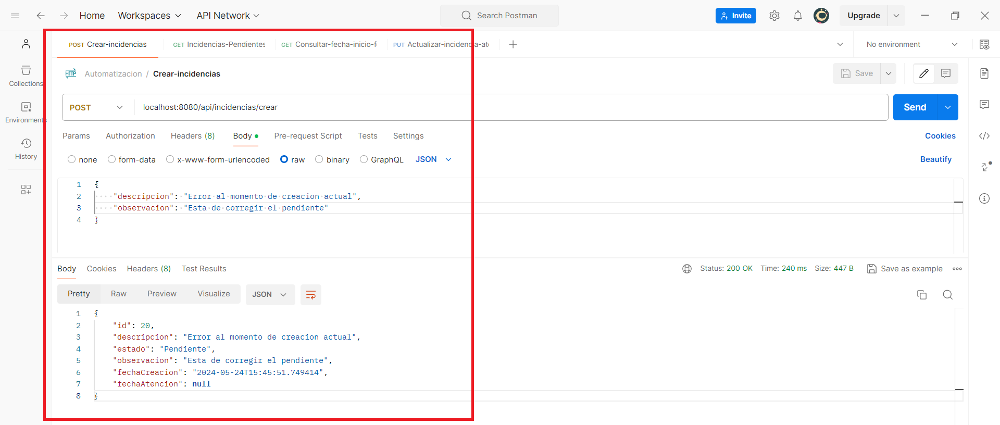
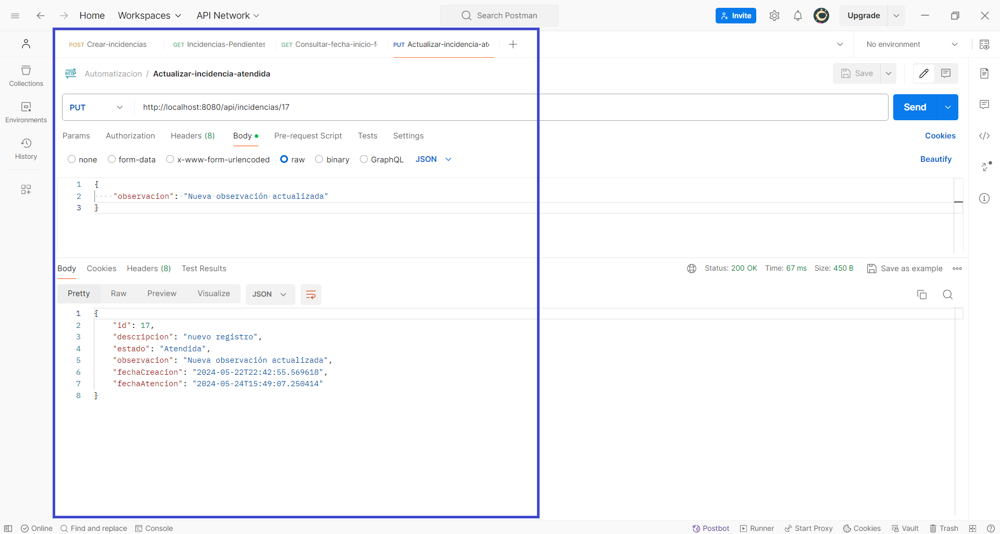

# Requerimiento de automatización Backend
Para iniciar con este requerimiento lo primero que se debe de hacer es clonar este repositorio.
## Iniciar el proyecto de SpringBoot 

Una vez iniciado el proyecto procedemos a hacer las pruebas correspondientes mediante la aplicacion postman. 

Debemos de tener en cuenta que vamos a crear una base datos en **postgresql** y lo vamos a declarar con el nombre de *db_automatizacion*

## Pruebas en Postman
### Crear una nueva incidencia.

### Obtener una lista de todas las incidencias por fecha inicio y fecha fin.

### Actualizar una o varias incidencias para ponerles como “Atendida” y colocar una observación por cada una.

### Obtener una lista de todas las incidencias “Pendientes” de ser atendidas.

